# SatQuery AI — End-to-End Architecture & Preprocessing Flowchart

This document provides a comprehensive visual and technical breakdown of the complete data lifecycle in SatQuery AI, detailing every transformation from client-side file upload to final frontend evidence rendering.

---

## 1. End-to-End System Flowchart

```mermaid
flowchart TD
    subgraph UI["Phase 1: Frontend Ingestion & Staging"]
        A1["User Drops Satellite Image (.tif / .tiff)"] --> A2["ImageUploader.tsx: Validate Extension"]
        A2 --> A3["Auto-Detect Analysis Mode<br/>(single | bi-temporal | optical-sar)"]
        A3 --> A4["User Enters Query in QueryBox"]
        A4 --> A5["SatQueryApiService.runAnalysis()<br/>Multipart POST to /api/analyze<br/>(Auto-retries on 502/503/504)"]
    end

    subgraph Server["Phase 2: Master Server Orchestrator"]
        A5 --> B1["satquery_server.py: analyze_query()"]
        B1 --> B2["Write File to data/inputs/uploads/"]
        B2 --> B3["Pydantic QueryRequest Formulation<br/>(Path, Query, Confidence, Physics Flag)"]
        B3 --> B4["SatQueryEngine.execute_query()"]
    end

    subgraph Ingestion["Phase 3: Geospatial Ingestion"]
        B4 --> C1["GeoTIFFLoader (rasterio / tifffile)"]
        C1 --> C2["Extract EPSG CRS & Affine Matrix"]
        C2 --> C3["Stack Multi-Band Array (C, H, W)"]
        C3 --> C4["detect_sensor_modality()<br/>(S2 Optical vs S1 SAR)"]
        C4 --> C5["create_valid_data_mask()<br/>(Strip empty slanted orbital borders)"]
    end

    subgraph Preproc["Phase 4: Physical Radiometric Preprocessing"]
        C5 --> D_Decision{"Sensor Modality?"}
        
        D_Decision -->|Optical Multi-Spectral| D_Opt["OpticalPreprocessor.calibrate()"]
        D_Opt --> D_Opt1["Convert DN to BOA Surface Reflectance<br/>rho = DN / 10000.0"]
        D_Opt1 --> D_Opt2["Clamp Reflectance to [0.0, 1.0]"]
        D_Opt2 --> D_Merge["Calibrated GeoTIFFData Object"]

        D_Decision -->|Radar SAR C-Band| D_SAR["SARPreprocessor.calibrate()"]
        D_SAR --> D_SAR1["Convert Amplitude to Intensity<br/>I = DN^2"]
        D_SAR1 --> D_SAR2["3x3 Spatial Boxcar / Lee Speckle Filter"]
        D_SAR2 --> D_SAR3["Decibel Transform<br/>sigma0 = 10 * log10(I)<br/>Clamp [-35.0 dB, +5.0 dB]"]
        D_SAR3 --> D_SAR4["Compute Cross-Ratio: VH - VV"]
        D_SAR4 --> D_Merge
    end

    subgraph AI["Phase 5: Routing & Neural Specialist Inference"]
        D_Merge --> E1["QueryRouter: Match Task Intent"]
        E1 --> E2{"Selected Specialist"}

        E2 -->|Single Optical / SAR| E_Single["SingleImageSpecialist<br/>(ConvNeXt-v2)"]
        E2 -->|Bi-Temporal Pre/Post| E_Change["ChangeDetectionSpecialist<br/>(Siamese ResNet-50)"]
        E2 -->|Cross-Modal Optical+SAR| E_Cross["CrossModalSpecialist<br/>(14-Channel ViT-Base)"]

        E_Single --> E_Scale["Adaptive Max-512 Canvas<br/>Downsample for fast forward pass"]
        E_Change --> E_Scale
        E_Cross --> E_Scale

        E_Scale --> E_Infer["Run Sliding Window Inference (1-4 tiles)"]
        E_Infer --> E_Restore["Bilinear Upsample Probabilities back to (H, W)"]
    end

    subgraph Physics["Phase 6: Deterministic Physics Verification"]
        E_Restore --> F1["PhysicsVerifier: Cross-Check Bands"]
        F1 --> F2["Compute NDWI: (Green - NIR) / (Green + NIR)"]
        F1 --> F3["Compute NDVI: (NIR - Red) / (NIR + Red)"]
        F1 --> F4["Verify SAR Backscatter: VV <= -18 dB"]
        F2 & F3 & F4 --> F5["Emit Audit Trace & Verdict<br/>(VERIFIED or FLAGGED)"]
    end

    subgraph Export["Phase 7: Vectorization & Artifact Rendering"]
        F5 --> G1["mask_to_geojson()<br/>Convert Mask Pixels to WGS84 Polygons"]
        F5 --> G2["ArtifactVisualizer"]
        G2 --> G3["Binary Mask PNG (data/outputs/masks/)"]
        G2 --> G4["Confidence Heatmap PNG (data/outputs/heatmaps/)"]
        G2 --> G5["RGBA 35% Alpha Overlay (data/outputs/overlays/)"]
        G2 --> G6["JSON Audit & Markdown Report"]
    end

    subgraph Client["Phase 8: Frontend Evidence Viewer"]
        G1 & G3 & G4 & G5 & G6 --> H1["Return JSON to NewAnalysisWorkspace.tsx"]
        H1 --> H2["7-Step Execution Tracker Completed"]
        H2 --> H3["EvidenceViewer.tsx:<br/>Interactive Before/After Slider<br/>Vector Polygons & Bounding Boxes<br/>Natural Language Summary<br/>1-Click PDF Report & GeoJSON Export"]
    end
```

---

## 2. Preprocessing Deep-Dive Flowchart

This flowchart outlines the exact mathematical transformations executed inside `satquery_core/src/ingestion/preprocessors.py`:

```mermaid
flowchart LR
    subgraph InputRaster["Raw Input Raster"]
        RAW["Raw 16-Bit / Multi-Band Satellite Raster<br/>Shape: (Channels, Height, Width)<br/>Data Type: uint16"]
    end

    subgraph ValidCheck["Valid Data Detection"]
        RAW --> V1["create_valid_data_mask()"]
        V1 --> V2["Find all-zero pixels: np.all(arr == 0)"]
        V1 --> V3["Find NaN or Inf values"]
        V1 --> V4["Find satellite NoData sentinels (0, -9999)"]
        V2 & V3 & V4 --> V_Mask["2D Boolean Validity Mask (H, W)<br/>True = Authentic Ground<br/>False = Outer Space / Orbit Border"]
    end

    subgraph OpticalBranch["Branch A: Optical BOA Surface Reflectance"]
        V_Mask --> O1["Detect Dynamic Range (DN)"]
        O1 --> O2["Apply Scale Factor: DN / 10000.0"]
        O2 --> O3["Clamp Reflectance to [0.0, 1.0]"]
        O3 --> O4["Zero out invalid mask pixels: data[~valid_mask] = 0.0"]
        O4 --> O_OUT["Physical Surface Reflectance Tensor<br/>rho in [0.0, 1.0]"]
    end

    subgraph SARBranch["Branch B: SAR Microwave Decibel Backscatter"]
        V_Mask --> S1["Linear Amplitude DN"]
        S1 --> S2["Compute Power Intensity: I = DN^2"]
        S2 --> S3["3x3 Spatial Boxcar / Lee Filter<br/>Smooths Speckle Microwave Noise"]
        S3 --> S4["Decibel Transformation:<br/>sigma0 (dB) = 10 * log10(max(I, epsilon))"]
        S4 --> S5["Clamp Terrestrial Bounds: [-35.0 dB, +5.0 dB]"]
        S5 --> S6["Calculate Cross-Ratio: CR = VH - VV"]
        S6 --> S_OUT["Calibrated SAR Backscatter Tensor<br/>sigma0 in [-35.0 dB, +5.0 dB]"]
    end
```

---

## 3. Preprocessing Mathematical Formulas Summary

| Stage | Input Domain | Formula / Operation | Target Domain | Physical Purpose |
| :--- | :--- | :--- | :--- | :--- |
| **Valid Mask** | Raw Tensor $(C, H, W)$ | $\text{Valid} = \neg (\text{Zero} \lor \text{NaN} \lor \text{NoData})$ | Boolean Grid $(H, W)$ | Discards black outer orbital borders. |
| **Optical Calibration** | Digital Numbers $DN \in [0, 10000]$ | $\rho = \text{clamp}\left(\frac{DN}{10000.0}, 0.0, 1.0\right)$ | Surface Reflectance $\rho \in [0.0, 1.0]$ | Converts raw sensor voltage to physical ground reflectance. |
| **SAR Intensity** | Linear Amplitude $A$ | $I = A^2$ | Microwave Power Intensity | Converts voltage amplitude to electromagnetic power. |
| **Speckle Filter** | Power Intensity $I$ | $\bar{I}_{r, c} = \frac{1}{9}\sum_{i=-1}^{1}\sum_{j=-1}^{1} I_{r+i, c+j}$ | Filtered Power Intensity | Suppresses coherent radar speckle (salt-and-pepper noise). |
| **SAR Decibel ($\text{dB}$)** | Filtered Intensity $\bar{I}$ | $\sigma^0 = 10 \cdot \log_{10}(\max(\bar{I}, 10^{-7}))$ | Calibrated Backscatter $[-35, +5]\text{ dB}$ | Compresses dynamic range for dielectric surface analysis. |
| **SAR Cross-Ratio** | Calibrated $\text{dB}$ | $CR = \text{VH}_{\text{dB}} - \text{VV}_{\text{dB}}$ | Polarization Ratio in $\text{dB}$ | Isolates volumetric vegetation scattering vs smooth water. |
